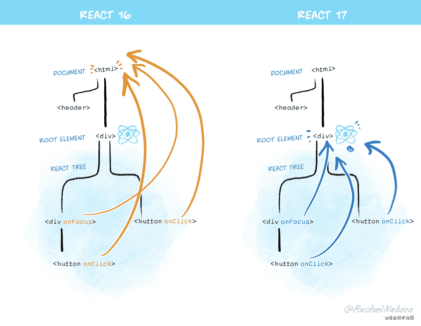

## react 基础

### react基本使用

1. 变量表达式
2. class style
3. 子元素和组件


```js
import React from 'react'
import './style.css'
import List from '../List'

class JSXBaseDemo extends React.Component {
    constructor(props) {
        super(props)
        this.state = {
            name: '双越',
            imgUrl: 'https://img1.mukewang.com/5a9fc8070001a82402060220-140-140.jpg',
            flag: true
        }
    }
    render() {
        // // 获取变量 插值
        // const pElem = <p>{this.state.name}</p>
        // return pElem

        // // 表达式
        // const exprElem = <p>{this.state.flag ? 'yes' : 'no'}</p>
        // return exprElem

        // // 子元素
        // const imgElem = <div>
        //     <p>我的头像</p>
        //     
        //     
        // </div>
        // return imgElem

        // // class
        // const classElem = <p className="title">设置 css class</p>
        // return classElem

        // // style
        // const styleData = { fontSize: '30px',  color: 'blue' }
        // const styleElem = <p style={styleData}>设置 style</p>
        // // 内联写法，注意 {{ 和 }}
        // // const styleElem = <p style={{ fontSize: '30px',  color: 'blue' }}>设置 style</p>
        // return styleElem

        // 原生 html
        const rawHtml = '<span>富文本内容<i>斜体</i><b>加粗</b></span>'
        const rawHtmlData = {
            __html: rawHtml // 注意，必须是这种格式
        }
        const rawHtmlElem = <div>
            <p dangerouslySetInnerHTML={rawHtmlData}></p>
            <p>{rawHtml}</p>
        </div>
        return rawHtmlElem

        // // 加载组件
        // const componentElem = <div>
        //     <p>JSX 中加载一个组件</p>
        //     <hr/>
        //     <List/>
        // </div>
        // return componentElem
    }
}

export default JSXBaseDemo

```

### 条件判断

1. if else
2. 三元表达式
3. 逻辑运算符 && ||

```js
import React from 'react'
import './style.css'

class ConditionDemo extends React.Component {
    constructor(props) {
        super(props)
        this.state = {
            theme: 'black'
        }
    }
    render() {
        const blackBtn = <button className="btn-black">black btn</button>
        const whiteBtn = <button className="btn-white">white btn</button>

        // // if else
        // if (this.state.theme === 'black') {
        //     return blackBtn
        // } else {
        //     return whiteBtn
        // }

        // // 三元运算符
        // return <div>
        //     { this.state.theme === 'black' ? blackBtn : whiteBtn }
        // </div>

        // &&
        return <div>
            { this.state.theme === 'black' && blackBtn }
        </div>
    }
}

export default ConditionDemo

```

### 列表渲染

map

key

```js
import React from 'react'

class ListDemo extends React.Component {
    constructor(props) {
        super(props)
        this.state = {
            list: [
                {
                    id: 'id-1',
                    title: '标题1'
                },
                {
                    id: 'id-2',
                    title: '标题2'
                },
                {
                    id: 'id-3',
                    title: '标题3'
                }
            ]
        }
    }
    render() {
        return <ul>
            { /* vue v-for */
                this.state.list.map(
                    (item, index) => {
                        // 这里的 key 和 Vue 的 key 类似，必填，不能是 index 或 random
                        return <li key={item.id}>
                            index {index}; id {item.id}; title {item.title}
                        </li>
                    }
                )
            }
        </ul>
    }
}

export default ListDemo

```

### event事件

```js
import React from 'react'

class EventDemo extends React.Component {
    constructor(props) {
        super(props)
        this.state = {
            name: 'zhangsan',
            list: [
                {
                    id: 'id-1',
                    title: '标题1'
                },
                {
                    id: 'id-2',
                    title: '标题2'
                },
                {
                    id: 'id-3',
                    title: '标题3'
                }
            ]
        }

        // 修改方法的 this 指向
        this.clickHandler1 = this.clickHandler1.bind(this)
    }
    render() {
        // // this - 使用 bind
        // return <p onClick={this.clickHandler1}>
        //     {this.state.name}
        // </p>

        // // this - 使用静态方法
        // return <p onClick={this.clickHandler2}>
        //     clickHandler2 {this.state.name}
        // </p>

        // // event
        // return <a href="https://imooc.com/" onClick={this.clickHandler3}>
        //     click me
        // </a>

        // 传递参数 - 用 bind(this, a, b)
        return <ul>{this.state.list.map((item, index) => {
            return <li key={item.id} onClick={this.clickHandler4.bind(this, item.id, item.title)}>
                index {index}; title {item.title}
            </li>
        })}</ul>
    }
    clickHandler1() {
        // console.log('this....', this) // this 默认是 undefined
        this.setState({
            name: 'lisi'
        })
    }
    // 静态方法，this 指向当前实例
    clickHandler2 = () => {
        this.setState({
            name: 'lisi'
        })
    }
    // 获取 event
    clickHandler3 = (event) => {
        event.preventDefault() // 阻止默认行为
        event.stopPropagation() // 阻止冒泡
        console.log('target', event.target) // 指向当前元素，即当前元素触发
        console.log('current target', event.currentTarget) // 指向当前元素，假象！！！

        // 注意，event 其实是 React 封装的。可以看 __proto__.constructor 是 SyntheticEvent 组合事件
        console.log('event', event) // 不是原生的 Event ，原生的 MouseEvent
        console.log('event.__proto__.constructor', event.__proto__.constructor)

        // 原生 event 如下。其 __proto__.constructor 是 MouseEvent
        console.log('nativeEvent', event.nativeEvent)
        console.log('nativeEvent target', event.nativeEvent.target)  // 指向当前元素，即当前元素触发
        console.log('nativeEvent current target', event.nativeEvent.currentTarget) // 指向 document ！！！

        // 1. event 是 SyntheticEvent ，模拟出来 DOM 事件所有能力
        // 2. event.nativeEvent 是原生事件对象
        // 3. 所有的事件，都被挂载到 document 上
        // 4. 和 DOM 事件不一样，和 Vue 事件也不一样
    }
    // 传递参数
    clickHandler4(id, title, event) {
        console.log(id, title)
        console.log('event', event) // 最后追加一个参数，即可接收 event
    }
}

export default EventDemo

```

react16和17event绑定元素的区别（event.nativeEvent.currentTarget）



### 表单

受控组件：通过input绑定state里的值，input的chang事件触发value值改变，进而改变state里的值

```js
import React from 'react'

class FormDemo extends React.Component {
    constructor(props) {
        super(props)
        this.state = {
            name: '双越',
            info: '个人信息',
            city: 'beijing',
            flag: true,
            gender: 'male'
        }
    }
    render() {

        // // 受控组件（非受控组件，后面再讲）
        // return <div>
        //     <p>{this.state.name}</p>
        //     <label htmlFor="inputName">姓名：</label> {/* 用 htmlFor 代替 for */}
        //     <input id="inputName" value={this.state.name} onChange={this.onInputChange}/>
        // </div>

        // textarea - 使用 value
        return <div>
            <textarea value={this.state.info} onChange={this.onTextareaChange}/>
            <p>{this.state.info}</p>
        </div>

        // // select - 使用 value
        // return <div>
        //     <select value={this.state.city} onChange={this.onSelectChange}>
        //         <option value="beijing">北京</option>
        //         <option value="shanghai">上海</option>
        //         <option value="shenzhen">深圳</option>
        //     </select>
        //     <p>{this.state.city}</p>
        // </div>

        // // checkbox
        // return <div>
        //     <input type="checkbox" checked={this.state.flag} onChange={this.onCheckboxChange}/>
        //     <p>{this.state.flag.toString()}</p>
        // </div>

        // // radio
        // return <div>
        //     male <input type="radio" name="gender" value="male" checked={this.state.gender === 'male'} onChange={this.onRadioChange}/>
        //     female <input type="radio" name="gender" value="female" checked={this.state.gender === 'female'} onChange={this.onRadioChange}/>
        //     <p>{this.state.gender}</p>
        // </div>

        // 非受控组件 - 后面再讲
    }
    onInputChange = (e) => {
        this.setState({
            name: e.target.value
        })
    }
    onTextareaChange = (e) => {
        this.setState({
            info: e.target.value
        })
    }
    onSelectChange = (e) => {
        this.setState({
            city: e.target.value
        })
    }
    onCheckboxChange = () => {
        this.setState({
            flag: !this.state.flag
        })
    }
    onRadioChange = (e) => {
        this.setState({
            gender: e.target.value
        })
    }
}

export default FormDemo
```

