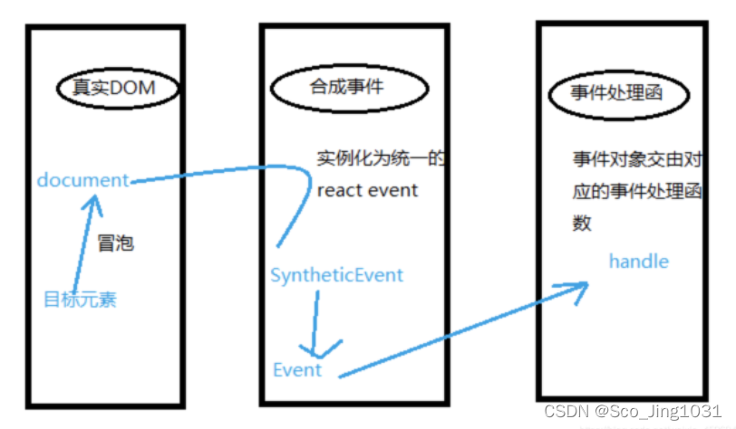

## React 原理

1. 函数式编程
2. vdom和diff算法
3. jsx的本质
4. 合成事件
5. setState  batchUpdate
6. 组件渲染过程

### 函数式编程

纯函数

不可变值

```js
this.setState({
	list: this.state.list.concat({
		id:`id-${Date.now()}`,
		title
	})
})

//不能用push、pop、splice
```

### vdom和diff算法

#### vnode

h函数

vnode数据结构

patch函数

```json
{
	tag:'div',
	prop:{
		className:'home'
		id:'home'
	},
	children:{
		{
			tag:'div',
			prop:{
				className:'namu'
			},
			children:{
				...
			}
		}
	}
}
```


#### diff算法

只比较同一级，不跨级比较

tag不相同，则直接删掉重建，不再深度比较

tag和key，两者都相同，则认为是相同节点，不在深度比较

### jsx的本质

React.createElement 即h函数，返回vnode

第一个参数，可能是组件，也可能是html tag

组件名，首字符必须大写（React规定）

```jsx
//jsx
const imgName = <div>
        <p>this is </p>
        <div className="namu" id="namu"><p>home</p></div>
      </div>
```

编译后

```js
const imgName = /*#__PURE__*/React.createElement("div", null, /*#__PURE__*/React.createElement("p", null, "this is "), /*#__PURE__*/React.createElement("div", {
  className: "namu",
  id: "namu"
}, /*#__PURE__*/React.createElement("p", null, "home")));
```

### 合成事件机制

所有事件都挂载到document上（react17之后的版本挂载到root节点上）

event不是原生的，是SyntheticEvent合成事件对象

和Vue事件不同，和DOM事件也不同

```js
render() {
        // event
        return <a href="https://imooc.com/" onClick={this.clickHandler3}>
            click me
        </a>
    }

// 获取 event
    clickHandler3 = (event) => {
        event.preventDefault() // 阻止默认行为
        event.stopPropagation() // 阻止冒泡
        console.log('target', event.target) // 指向当前元素，即当前元素触发
        console.log('current target', event.currentTarget) // 指向当前元素，假象！！！

        // 注意，event 其实是 React 封装的。可以看 __proto__.constructor 是 SyntheticEvent 组合事件
        console.log('event', event) // 不是原生的 Event ，原生的 MouseEvent
        console.log('event.__proto__.constructor', event.__proto__.constructor)

        // 原生 event 如下。其 __proto__.constructor 是 MouseEvent
        console.log('nativeEvent', event.nativeEvent)
        console.log('nativeEvent target', event.nativeEvent.target)  // 指向当前元素，即当前元素触发
        console.log('nativeEvent current target', event.nativeEvent.currentTarget) // 指向 document 

        // 1. event 是 SyntheticEvent ，模拟出来 DOM 事件所有能力
        // 2. event.nativeEvent 是原生事件对象
        // 3. 所有的事件，都被挂载到 document 上
        // 4. 和 DOM 事件不一样，和 Vue 事件也不一样
    }
```

合成事件机制图示



**为什么要用合成事件机制？**

更好的兼容性和跨平台

挂载到document上（17以后版本是root节点），减少内存消耗，避免频繁解绑

方便事件的统一管理（事务机制）

**React17事件绑定到root**

react16绑定到document上

react17事件绑定到root组件上

有利于多个react版本并存