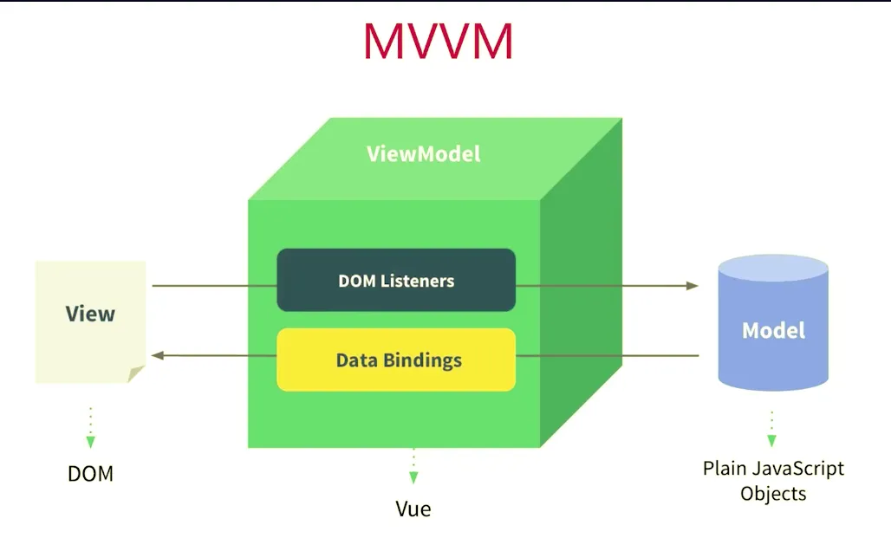
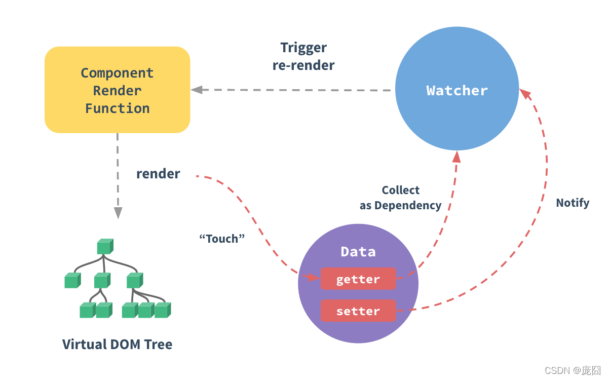

## vue原理

1. 组件化
2. 响应式
3. vdom和diff
4. 模板渲染
5. 渲染过程
6. 前端路由

### 组件化基础

“很久以前”就有组件化

数据驱动视图（MVVM，setState）

asp jsp php 已经有组件化了

nodejs中也有组件化

**数据驱动视图**

传统组件，只是静态渲染，更新还要依赖于操作Dom

数据驱动视图 - Vue MVVM 和 React setState




### vue响应式

核心API -  Object.defineProperty

Object.defineProperty的一些缺点（Vue3 启用 Proxy）

proxy有兼容性问题，而且无法polyfill

```js
const data = {}
const name = 'zhangsan'
Object.defineProperty(data, "name", {
	get: function() {
		console.log('get')
		return name
	}
	set: function() {
		console.log('set')
		name = newVal
	}
})

console.log(data.name)  //get zhangsan
data.name = 'lisi' //set
```

监听对象，监听数组

复杂对象，深度监听

几个缺点

### 深度监听

#### vue如何监听对象

适用递归的方式可以监听对象

```js
// 触发更新视图
function updateView() {
    console.log('视图更新')
}

// 重新定义属性，监听起来
function defineReactive(target, key, value) {
    // 深度监听
    observer(value)

    // 核心 API
    Object.defineProperty(target, key, {
        get() {
            return value
        },
        set(newValue) {
            if (newValue !== value) {
                // 深度监听
                observer(newValue)

                // 设置新值
                // 注意，value 一直在闭包中，此处设置完之后，再 get 时也是会获取最新的值
                value = newValue

                // 触发更新视图
                updateView()
            }
        }
    })
}

// 监听对象属性
function observer(target) {
    if (typeof target !== 'object' || target === null) {
        // 不是对象或数组
        return target
    }

    // 重新定义各个属性（for in 也可以遍历数组）
    for (let key in target) {
        defineReactive(target, key, target[key])
    }
}

// 准备数据
const data = {
    name: 'zhangsan',
    age: 20,
    info: {
        address: '北京' // 需要深度监听
    }
}

// 监听数据
observer(data)
```

#### vue如何监听数组

```js
// 重新定义数组原型
const oldArrayProperty = Array.prototype
// 创建新对象，原型指向 oldArrayProperty ，再扩展新的方法不会影响原型
const arrProto = Object.create(oldArrayProperty);
['push', 'pop', 'shift', 'unshift', 'splice'].forEach(methodName => {
    arrProto[methodName] = function () {
        oldArrayProperty[methodName].call(this, ...arguments)
        // Array.prototype.push.call(this, ...arguments)
        updateView() // 触发视图更新
    }
})

// 监听对象属性
function observer (target) {
    if (typeof target !== 'object' || target === null) {
        // 不是对象或数组
        return target
    }

    // 污染全局的 Array 原型
    // Array.prototype.push = function () {
    //     updateView()
    //     ...
    // }

    if (Array.isArray(target)) {
        target.__proto__ = arrProto
    }

    // 重新定义各个属性（for in 也可以遍历数组）
    for (let key in target) {
        defineReactive(target, key, target[key])
    }
}

// 准备数据
const data = {
    name: 'zhangsan',
    age: 20,
    info: {
        address: '北京' // 需要深度监听
    },
    nums: [10, 20, 30]
}

// 监听数据
observer(data)

data.nums.push(4) // 监听数组
```

### 虚拟DOM

vdom(virtualDOM)是实现vue和react的重要基石

diff算法是vdom中最核心，最关键的部分


DOM操作非常消耗性能

以前用JQuery，可以控制DOM操作的时机，手动调整

Vue和React是数据驱动视图


有了一定复杂度，想要减少计算次数比较困难

能不能把计算，更多的转移为JS计算，因为JS执行速度很快

vdom - 用JS模拟DOM结构，计算出最小的变更，操作DOM


如何用JS模拟DOM结构

```html
<div id="div1" class="container">
	<P>vdom</p>
	<ul style="font-size:20px">
		<li>a</li>
	</ul>
</div>
```

```json
{
	"tag":'div',
	"props":{
		"className":'container',
		"id":1
	},
	"children":[
		{
			"tag":'p',
			"children":'vdom'
		},
		{
			"tag":'ul',
			"props": {"style":'font-size: 20px'},
			"children":[
				{
					"tag":'li',
					"children": 'a'
				}
			]
		}
	]
}
```

通过snabbdom学习vdom

简洁强大的vdom库，易学易用

Vue参考它实现的vdom的diff


vue3.0重写了vdom的代码，优化了性能，但vdom的基本理念不变

snabbdom-demo

```js
const snabbdom = window.snabbdom

// 定义 patch
const patch = snabbdom.init([
    snabbdom_class,
    snabbdom_props,
    snabbdom_style,
    snabbdom_eventlisteners
])

// 定义 h
const h = snabbdom.h

const container = document.getElementById('container')

// 生成 vnode
const vnode = h('ul#list', {}, [
    h('li.item', {}, 'Item 1'),
    h('li.item', {}, 'Item 2')
])
patch(container, vnode)

document.getElementById('btn-change').addEventListener('click', () => {
    // 生成 newVnode
    const newVnode = h('ul#list', {}, [
        h('li.item', {}, 'Item 1'),
        h('li.item', {}, 'Item B'),
        h('li.item', {}, 'Item 3')
    ])
    patch(vnode, newVnode)

    // vnode = newVnode // patch 之后，应该用新的覆盖现有的 vnode ，否则每次 change 都是新旧对比
})

```

传统的重新渲染

```html
<!DOCTYPE html>
<html>
<head>
    <meta charset="UTF-8">
    <title>Document</title>
</head>
<body>
    <div id="container"></div>
    <button id="btn-change">change</button>

    <script type="text/javascript" src="https://cdn.bootcss.com/jquery/3.2.0/jquery.js"></script>
    <script type="text/javascript">
        const data = [
            {
                name: '张三',
                age: '20',
                address: '北京'
            },
            {
                name: '李四',
                age: '21',
                address: '上海'
            },
            {
                name: '王五',
                age: '22',
                address: '广州'
            }
        ]

        // 渲染函数
        function render(data) {
            const $container = $('#container')

            // 清空容器，重要！！！
            $container.html('')

            // 拼接 table
            const $table = $('<table>')

            $table.append($('<tr><td>name</td><td>age</td><td>address</td>/tr>'))
            data.forEach(item => {
                $table.append($('<tr><td>' + item.name + '</td><td>' + item.age + '</td><td>' + item.address + '</td>/tr>'))
            })

            // 渲染到页面
            $container.append($table)
        }

        $('#btn-change').click(() => {
            data[1].age = 30
            data[2].address = '深圳'
            // re-render  再次渲染
            render(data)
        })

        // 页面加载完立刻执行（初次渲染）
        render(data)

    </script>
</body>
</html>
```

使用vdom的重新渲染

```html
<!DOCTYPE html>
<html>
<head>
    <meta charset="UTF-8">
    <title>Document</title>
</head>
<body>
    <div id="container"></div>
    <button id="btn-change">change</button>

    <script src="https://cdn.bootcss.com/snabbdom/0.7.3/snabbdom.js"></script>
    <script src="https://cdn.bootcss.com/snabbdom/0.7.3/snabbdom-class.js"></script>
    <script src="https://cdn.bootcss.com/snabbdom/0.7.3/snabbdom-props.js"></script>
    <script src="https://cdn.bootcss.com/snabbdom/0.7.3/snabbdom-style.js"></script>
    <script src="https://cdn.bootcss.com/snabbdom/0.7.3/snabbdom-eventlisteners.js"></script>
    <script src="https://cdn.bootcss.com/snabbdom/0.7.3/h.js"></script>
    <script type="text/javascript">
        const snabbdom = window.snabbdom
        // 定义关键函数 patch
        const patch = snabbdom.init([
            snabbdom_class,
            snabbdom_props,
            snabbdom_style,
            snabbdom_eventlisteners
        ])

        // 定义关键函数 h
        const h = snabbdom.h

        // 原始数据
        const data = [
            {
                name: '张三',
                age: '20',
                address: '北京'
            },
            {
                name: '李四',
                age: '21',
                address: '上海'
            },
            {
                name: '王五',
                age: '22',
                address: '广州'
            }
        ]
        // 把表头也放在 data 中
        data.unshift({
            name: '姓名',
            age: '年龄',
            address: '地址'
        })

        const container = document.getElementById('container')

        // 渲染函数
        let vnode
        function render(data) {
            const newVnode = h('table', {}, data.map(item => {
                const tds = []
                for (let i in item) {
                    if (item.hasOwnProperty(i)) {
                        tds.push(h('td', {}, item[i] + ''))
                    }
                }
                return h('tr', {}, tds)
            }))

            if (vnode) {
                // re-render
                patch(vnode, newVnode)
            } else {
                // 初次渲染
                patch(container, newVnode)
            }

            // 存储当前的 vnode 结果
            vnode = newVnode
        }

        // 初次渲染
        render(data)


        const btnChange = document.getElementById('btn-change')
        btnChange.addEventListener('click', () => {
            data[1].age = 30
            data[2].address = '深圳'
            // re-render
            render(data)
        })

    </script>
</body>
</html>
```

总结：

用JS模拟DOM结构

新旧vnode做对比，得出最小的更新范围，最后更新DOM

数据驱动视图下，有效控制DOM操作

### diff算法

diff即对比，是一个广泛的概念，如linux diff 命令，git diff等

两个js对象也可以做diff，如https://github.com/cujojs/jiff

两棵树做diff，如vdom diff

**树的diff算法的时间复杂度是O(n^3)**

第一，遍历tree1，第二，遍历tree2，第三，排序

1000个节点，要计算1亿次，算法不可用

**优化时间复杂度到O(n)**

只比较同一层，不跨域比较

tag不相同，则直接删掉重建，不再深度比较

tag和key，两者都相同，则认为是相同节点，不再深度比较

### 模板编译

**前置知识：JS的with语法**

```js
const obj ={a:100,b:200}
console.log(obj.a)
console.log(obj.b)
console.log(obj.c) //undefined

with(obj){
	console.log(a)
	console.log(b)
	console.log(c) //报错
}
```

**vue template complier将模板编译为render函数**

```js
const compiler = require('vue-template-compiler')

// 插值
// const template = `<p>{{message}}</p>`
// with(this){return createElement('p',[createTextVNode(toString(message))])}
// h -> vnode
// createElement -> vnode

// // 表达式
// const template = `<p>{{flag ? message : 'no message found'}}</p>`
// // with(this){return _c('p',[_v(_s(flag ? message : 'no message found'))])}

// // 属性和动态属性
// const template = `
//     <div id="div1" class="container">
//         
//     </div>
// `
// with(this){return _c('div',
//      {staticClass:"container",attrs:{"id":"div1"}},
//      [
//          _c('img',{attrs:{"src":imgUrl}})])}

// // 条件
// const template = `
//     <div>
//         <p v-if="flag === 'a'">A</p>
//         <p v-else>B</p>
//     </div>
// `
// with(this){return _c('div',[(flag === 'a')?_c('p',[_v("A")]):_c('p',[_v("B")])])}

// 循环
// const template = `
//     <ul>
//         <li v-for="item in list" :key="item.id">{{item.title}}</li>
//     </ul>
// `
// with(this){return _c('ul',_l((list),function(item){return _c('li',{key:item.id},[_v(_s(item.title))])}),0)}

// 事件
// const template = `
//     <button @click="clickHandler">submit</button>
// `
// with(this){return _c('button',{on:{"click":clickHandler}},[_v("submit")])}

// v-model
const template = `<input type="text" v-model="name">`
// 主要看 input 事件
// with(this){return _c('input',{directives:[{name:"model",rawName:"v-model",value:(name),expression:"name"}],attrs:{"type":"text"},domProps:{"value":(name)},on:{"input":function($event){if($event.target.composing)return;name=$event.target.value}}})}

// render 函数
// 返回 vnode
// patch

// 编译
const res = compiler.compile(template)
console.log(res.render)

// ---------------分割线--------------

// // 从 vue 源码中找到缩写函数的含义
// function installRenderHelpers (target) {
//     target._o = markOnce;
//     target._n = toNumber;
//     target._s = toString;
//     target._l = renderList;
//     target._t = renderSlot;
//     target._q = looseEqual;
//     target._i = looseIndexOf;
//     target._m = renderStatic;
//     target._f = resolveFilter;
//     target._k = checkKeyCodes;
//     target._b = bindObjectProps;
//     target._v = createTextVNode;
//     target._e = createEmptyVNode;
//     target._u = resolveScopedSlots;
//     target._g = bindObjectListeners;
//     target._d = bindDynamicKeys;
//     target._p = prependModifier;
// }

```

模板编译为render函数，执行render函数返回vnode

基于vnode再执行patch和diff

使用webpack vue-loader，会在开发环境下编译模板（重要）

### render代替template

```js
Vue.component('heading',{
	render:function(creatElement){
		return createElement(
			'h'+this.level,
			[
				createElement('a',{
					attrs: {
						name:'headerId',
						href: '#'+'headerId'
					}
				}, 'this is a tag')
			]
		)
	}
})
```

### vue渲染更新过程

#### 初次渲染

1.解析模板为render函数（或在开发环境已完成，vue-loader）

2.触发响应式，监听data属性 getter setter

3.执行render函数，生成vnode, patch(elem,vnode)

#### 组件更新

1.修改data，触发setter(此前在getter中已被监听)

2.重新执行render函数，生成newVnode

3.patch(vnode,newVnode)

图示：



#### 异步渲染

$nextTick 语法就是异步渲染

汇总data的修改，一次性更新视图

减少DOM操作次数，提高性能

### 前端路由原理

vue-router的路由模式

**hash**

**H5 history**


#### hash

hash的特点

hash变化会触发网页的跳转，即浏览器的前进、后退

hash变化不会刷新页面，SPA必需的特点

hash永远不会提交到server端（前端自身自灭）

通过监听hash的变化来触发路由的跳转

```html
<!DOCTYPE html>
<html lang="en">
<head>
    <meta charset="UTF-8">
    <meta name="viewport" content="width=device-width, initial-scale=1.0">
    <meta http-equiv="X-UA-Compatible" content="ie=edge">
    <title>hash test</title>
</head>
<body>
    <p>hash test</p>
    <button id="btn1">修改 hash</button>

    <script>
        // hash 变化，包括：
        // a. JS 修改 url
        // b. 手动修改 url 的 hash
        // c. 浏览器前进、后退
        window.onhashchange = (event) => {
            console.log('old url', event.oldURL)
            console.log('new url', event.newURL)

            console.log('hash:', location.hash)
        }

        // 页面初次加载，获取 hash
        document.addEventListener('DOMContentLoaded', () => {
            console.log('hash:', location.hash)
        })

        // JS 修改 url
        document.getElementById('btn1').addEventListener('click', () => {
            location.href = '#/user'
        })
    </script>
</body>
</html>
```

#### H5 history

用url规范的路由，但跳转时不刷新页面

history.pushState

window.onpopState

```html
<!DOCTYPE html>
<html lang="en">
<head>
    <meta charset="UTF-8">
    <meta name="viewport" content="width=device-width, initial-scale=1.0">
    <meta http-equiv="X-UA-Compatible" content="ie=edge">
    <title>history API test</title>
</head>
<body>
    <p>history API test</p>
    <button id="btn1">修改 url</button>

    <script>
        // 页面初次加载，获取 path
        document.addEventListener('DOMContentLoaded', () => {
            console.log('load', location.pathname)
        })

        // 打开一个新的路由
        // 【注意】用 pushState 方式，浏览器不会刷新页面
        document.getElementById('btn1').addEventListener('click', () => {
            const state = { name: 'page1' }
            console.log('切换路由到', 'page1')
            history.pushState(state, '', 'page1') // 重要！！
        })

        // 监听浏览器前进、后退
        window.onpopstate = (event) => { // 重要！！
            console.log('onpopstate', event.state, location.pathname)
        }

        // 需要 server 端配合，可参考
        // https://router.vuejs.org/zh/guide/essentials/history-mode.html#%E5%90%8E%E7%AB%AF%E9%85%8D%E7%BD%AE%E4%BE%8B%E5%AD%90
    </script>
</body>
</html>
```

#### 两者选择

1.toB的系统推荐用hash，简单易用，对url规范不敏感

2.toC的系统，可以考虑用H5history，但需要服务端支持

